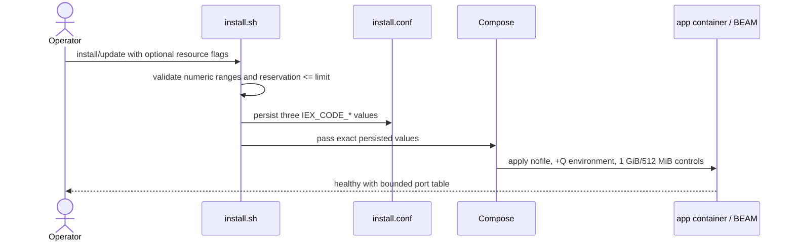
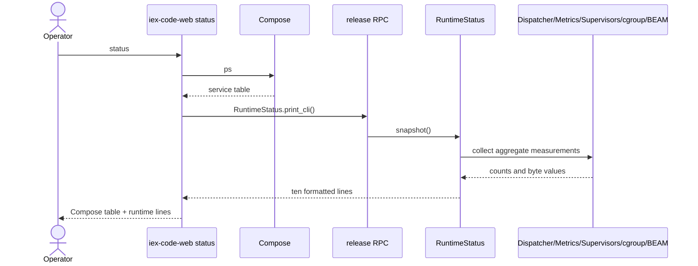

# Requirements

## Introduction
IexCode Web needs predictable VPS memory use and an operator-visible answer to whether autonomous work is actually running. The current deployment inherits a host `nofile` ceiling of `1,073,741,816`, which causes OTP to reserve a `134,217,727`-entry port table even though the observed application used only seven ports; correcting that mismatch is the primary idle-memory fix. This feature gives the trusted VPS operator conservative container guardrails, configurable installer defaults, and matching CLI and Settings runtime status without reducing application concurrency or terminating dormant terminals.

## Requirements

### Requirement 1: Bound the application runtime
**User Story:** As the VPS operator, I want the application container and BEAM port table bounded, so that an idle deployment does not waste gigabytes of RAM.

#### Acceptance Criteria
1.1 WHEN the app is installed without resource overrides THEN the app container SHALL have both its soft and hard `nofile` limits set to exactly `65536`.
1.2 WHEN the main release or an Erlang/Elixir/Mix child process starts in the app container with default configuration THEN its BEAM SHALL receive `+Q 65536`; the main release SHALL report `:erlang.system_info(:port_limit) == 65536`.
1.3 WHEN a valid `--nofile-limit N` override is installed THEN the container soft limit, hard limit, and inherited BEAM `+Q` value SHALL all equal `N`.
1.4 WHEN the app is installed without memory overrides THEN Docker SHALL report a hard app-container memory limit of exactly `1,073,741,824` bytes and a soft reservation of exactly `536,870,912` bytes.
1.5 WHEN Compose renders the app service THEN it SHALL NOT define `memswap_limit`, change scheduler count, change process limits other than `nofile`, change SQLite pool size, change tmpfs sizes, or change dispatcher concurrency.

### Requirement 2: Configure and preserve guardrails
**User Story:** As the VPS operator, I want validated installer options persisted with the deployment, so that I can tune a larger or smaller host without hand-editing Compose files.

#### Acceptance Criteria
2.1 WHEN `install.sh --help` is run THEN it SHALL document `--memory-limit-mib` with default `1024` and range `256..65536`, `--memory-reservation-mib` with default `512` and range `128..memory-limit`, and `--nofile-limit` with default `65536` and range `4096..1048576`.
2.2 IF a guardrail option is missing its value, non-decimal, signed, fractional, below its minimum, or above its maximum THEN the installer SHALL exit `1` and print exactly `ERROR: --memory-limit-mib must be an integer between 256 and 65536`, `ERROR: --memory-reservation-mib must be an integer between 128 and --memory-limit-mib`, or `ERROR: --nofile-limit must be an integer between 4096 and 1048576`, as applicable.
2.3 IF the memory reservation exceeds the memory limit THEN the installer SHALL exit `1` and print exactly `ERROR: --memory-reservation-mib must be an integer between 128 and --memory-limit-mib`.
2.4 WHEN installation succeeds THEN `/etc/iex-code-web/install.conf` SHALL contain shell-escaped `IEX_CODE_MEMORY_LIMIT_MIB`, `IEX_CODE_MEMORY_RESERVATION_MIB`, and `IEX_CODE_NOFILE_LIMIT` values and Compose SHALL receive those exact values.
2.5 WHEN `iex-code-web update` invokes `install.sh --update-only` without a resource override THEN all three persisted resource values SHALL be reused; WHEN an explicit valid override is supplied to `install.sh --update-only` THEN only explicitly supplied resource values SHALL replace their persisted values.

### Requirement 3: Produce a failure-tolerant runtime snapshot
**User Story:** As the VPS operator, I want one aggregate runtime snapshot, so that the CLI and browser agree about memory use and whether work is running.

#### Acceptance Criteria
3.1 WHEN `IexCode.Observability.RuntimeStatus.snapshot/1` succeeds THEN it SHALL return the exact aggregate groups `state`, `container`, `beam`, `dispatcher`, and `activity` defined in the Design data model, without any run, agent, session, project, worker, lease, command, prompt, or credential identifiers.
3.2 WHEN active runs, queued runs, active or paused agents, fleets, or active DAG attempts has a known count greater than zero THEN `state` SHALL be `:active`; WHEN all those counts are known and zero THEN `state` SHALL be `:idle`; WHEN none is positive and any required activity count is unavailable THEN `state` SHALL be `:unavailable`.
3.3 WHEN only sessions or dormant terminals exist THEN they SHALL be counted for display but SHALL NOT change `state` from `:idle`.
3.4 WHEN cgroup-v2 `memory.current` and `memory.max` contain non-negative decimal byte values THEN the snapshot SHALL return those integers; `memory.max` containing `max` SHALL return `:unlimited`; a missing, unreadable, negative, or malformed value SHALL return `nil` for that measurement.
3.5 IF the dispatcher, metrics store, a dynamic supervisor, a cgroup read, or a BEAM measurement raises, exits, throws, or returns malformed data THEN the snapshot SHALL return `nil` for the affected measurement and SHALL NOT crash its caller.

### Requirement 4: Show runtime facts in the deployment CLI
**User Story:** As the VPS operator, I want `iex-code-web status` to include application activity and memory, so that I do not need ad hoc Docker or Erlang commands for routine checks.

#### Acceptance Criteria
4.1 WHEN `iex-code-web status` runs THEN it SHALL run and print `docker compose ps` first and preserve a non-zero Compose exit status.
4.2 WHEN the app is running and runtime inspection succeeds THEN status SHALL invoke `/opt/iex-code/bin/iex_code rpc 'IexCode.Observability.RuntimeStatus.print_cli()'` in the app and append exactly the ten CLI lines defined in the Design section.
4.3 IF the app is running and runtime RPC fails THEN status SHALL keep the successful Compose output, exit `0`, and print exactly `iex-code-web: warning: runtime status unavailable; service status is shown above` to stderr.
4.4 WHEN the app is stopped THEN status SHALL print only Compose status and SHALL NOT attempt runtime RPC.

### Requirement 5: Show runtime facts in Settings
**User Story:** As the browser operator, I want a polished read-only runtime panel in Settings, so that activity, capacity, and memory are visible without SSH.

#### Acceptance Criteria
5.1 WHEN Settings renders THEN its Runtime section SHALL show state, container memory current/limit, BEAM memory, BEAM ports used/limit, active/queued/capacity run counts, active agents, fleets, active DAG attempts, sessions, and terminals using stable DOM IDs defined in Design.
5.2 WHEN a connected Settings LiveView remains open THEN it SHALL refresh only its runtime snapshot every `5000` milliseconds.
5.3 WHEN a runtime refresh occurs while the settings form is dirty or invalid THEN all attempted form values, validation errors, dirty status, and navigation guard SHALL remain unchanged.
5.4 IF runtime collection fails or returns malformed data THEN Settings SHALL remain usable, render state `Unavailable`, and render unavailable measurements as `Unavailable` rather than crashing.
5.5 WHEN Settings renders the Runtime section THEN every runtime value SHALL be read-only and SHALL NOT be submitted in `#settings-form`.

### Requirement 6: Document operation and verification
**User Story:** As the VPS operator, I want installation and operations guidance for the new limits, so that I can verify defaults and diagnose an idle-memory regression safely.

#### Acceptance Criteria
6.1 WHEN the VPS installation guide describes resource options THEN it SHALL list all three option names, defaults, ranges, persisted keys, and an example that does not contain a secret.
6.2 WHEN the operations guide describes status THEN it SHALL define `idle` as zero queued/active runs, agents, fleets, and DAG attempts; it SHALL explicitly say dormant sessions and terminals do not make the app active.
6.3 WHEN the operations guide describes memory verification THEN it SHALL include commands to inspect container memory current/limit, `ulimit -n`, BEAM `port_limit`, and cgroup `memory.events`, plus the five-minute idle targets below.

## Non-Functional Requirements
- Performance: After five continuous minutes with zero queued/active runs, agents, fleets, or DAG attempts, app-container `memory.current` SHALL remain below `629,145,600` bytes (600 MiB), and `:erlang.memory(:total)` SHALL remain below `314,572,800` bytes (300 MiB); expected normal full-app idle use is 100–250 MiB.
- Security: Runtime surfaces SHALL expose aggregate counts only, require the existing authenticated Settings route or root deployment command, and SHALL never expose identifiers, prompts, commands, output, environment values, credentials, or the Docker socket.
- Reliability: The app SHALL retain its existing `restart: unless-stopped` behavior and 60-second stop grace period; individual measurement failures SHALL degrade to `Unavailable` without taking down Settings or hiding Compose service state.
- Usability: CLI labels and Settings labels SHALL use the same idle/active definition, byte values SHALL be formatted as B/KiB/MiB/GiB, and the Runtime panel SHALL remain responsive at mobile and desktop widths.

## Out of Scope
- Scheduler-count tuning, process-limit tuning other than `nofile`, SQLite pool changes, tmpfs changes, terminal reaping, cache eviction, history pagination, output limiting, and dispatcher/DAG concurrency changes.
- Adding host swap or a Compose `memswap_limit`; the target VPS currently has no swap.
- Automatically cancelling, pausing, or reaping work when the memory limit is approached.
- Applying these limits to the separate `access-gate` deployment; it has its own repository and resource issue.
- Multi-tenant observability, historical metrics storage, alerts, or a public runtime-status HTTP endpoint.

# Design

## Overview
The fix is intentionally narrow. Compose lowers the app container's inherited file-descriptor ceiling, passes the same value as the BEAM `+Q` ceiling to the release and descendant Erlang/Elixir processes, and sets a 1 GiB hard memory boundary with a 512 MiB reservation. The installer becomes the single validated source for those values, while a new failure-tolerant `RuntimeStatus` module provides one secret-free snapshot to both the release RPC used by `iex-code-web status` and the existing Runtime section in Settings.

The confirmed root cause is the mismatch between actual use and the inherited ceiling: `nofile=1,073,741,816` led OTP to allocate for `134,217,727` ports while only seven were used, wasting approximately 2.17 GiB. An isolated test using a `65,536` port limit reduced a clean VM from roughly 2.18 GiB to roughly 31 MiB. The memory cap is a safety boundary, not the primary optimization; the port-table correction is expected to put the full idle application well below 600 MiB.

## Code Reuse Analysis
- **RunDispatcher** (`lib/iex_code/runs/run_dispatcher.ex`): Reuse the verified `def get_stats(server \\ __MODULE__), do: GenServer.call(server, :get_stats)` interface and its `active`, `queued`, and `capacity` result fields.
- **MetricsStore** (`lib/iex_code/observability/metrics_store.ex`): Reuse the verified `def snapshot(server \\ __MODULE__), do: GenServer.call(server, :snapshot)` interface and its bounded `control_plane` fields for durable run, agent, and DAG activity.
- **Dynamic supervisors** (`lib/iex_code/engine/*_supervisor.ex`, `lib/iex_code/tools/terminal_supervisor.ex`): Reuse `DynamicSupervisor.count_children/1`; `TerminalSupervisor` already exposes the same result through `def count_children do DynamicSupervisor.count_children(__MODULE__) end`.
- **Settings runtime section** (`lib/iex_code_web/live/settings_live.ex`, `lib/iex_code_web/live/settings_live.html.heex`): Replace the existing verified `|> assign(:runtime_facts, runtime_facts())` and `:for={fact <- @runtime_facts}` static online/offline list rather than creating another Settings route or component.
- **Deployment manager** (`deploy/iex-code-web`): Extend the existing verified `status) compose ps ;;` command and existing `compose()` topology/environment wrapper, so status and update continue respecting IP, domain, and behind-proxy installations.
- **Installer configuration** (`install.sh`): Extend `parse_args/validate_args/load_existing_config/write_environment/compose`; these already implement set flags, validated scalar persistence in `/etc/iex-code-web/install.conf`, and update preservation for public host, repo, ref, and workspace values.
- **LiveView test conventions** (`test/iex_code_web/live/settings_live_test.exs`): Reuse `IexCode.E2E.Case`, stable element IDs, `send(view.pid, ...)`, and `_ = :sys.get_state(view.pid)`; do not add sleeps or raw HTML assertions.

## Architecture

```text
install.sh validated resource values
  -> /etc/iex-code-web/install.conf
  -> Compose interpolation
  -> app ulimit + inherited +Q + cgroup memory controls

RunDispatcher + MetricsStore + DynamicSupervisors + cgroup-v2 + BEAM
  -> IexCode.Observability.RuntimeStatus.snapshot/1
  -> release RPC -> iex-code-web status
  -> SettingsLive assign -> read-only Runtime panel
```

### Main Flows





```mermaid
sequenceDiagram
    actor Browser
    participant Settings as SettingsLive
    participant Runtime as RuntimeStatus
    participant Source as Restarting/unavailable source
    Browser->>Settings: open authenticated Settings
    Settings->>Runtime: snapshot()
    Runtime->>Source: measure
    Source--xRuntime: raise / exit / malformed value
    Runtime-->>Settings: nil measurement or unavailable state
    Settings-->>Browser: usable panel with Unavailable labels
    Note over Settings: schedule another refresh in 5000 ms; preserve form assigns
```

## File Structure Plan

```text
.github/workflows/ci.yml                                  (edit)
assets/css/app.css                                        (edit)
compose.yaml                                              (edit)
deploy/iex-code-web                                       (edit)
docs/INSTALL_VPS.md                                       (edit)
docs/OPERATIONS.md                                        (edit)
install.sh                                                (edit)
lib/iex_code/observability/runtime_status.ex              (new)
lib/iex_code_web/live/settings_live.ex                    (edit)
lib/iex_code_web/live/settings_live.html.heex              (edit)
test/deploy/deployment_static_test.sh                      (edit)
test/deploy/status_command_test.sh                        (new)
test/iex_code/observability/runtime_status_test.exs        (new)
test/iex_code_web/live/settings_live_test.exs              (edit)
test/support/runtime_status_reader_stub.ex                (new)
```

## Components and Interfaces

### Compose app resource controls
- **Purpose:** Apply the OS, BEAM, and cgroup bounds to the app container while leaving proxy and concurrency behavior unchanged.
- **File:** `compose.yaml`
- **Interfaces:** `${IEX_CODE_MEMORY_LIMIT_MIB:-1024}`, `${IEX_CODE_MEMORY_RESERVATION_MIB:-512}`, `${IEX_CODE_NOFILE_LIMIT:-65536}`.
- **Dependencies:** Docker Compose `mem_limit`, `mem_reservation`, `ulimits.nofile`, environment inheritance; `ERL_AFLAGS` and `ELIXIR_ERL_OPTIONS` both carry the same `+Q` value so the release, direct Erlang processes, Elixir, and Mix descendants are covered.
- **Reuses:** Existing app service, environment, and restart configuration.
- **Satisfies:** 1.1, 1.2, 1.3, 1.4, 1.5.

### Installer resource configuration
- **Purpose:** Validate, persist, restore, and pass the three deployment guardrails.
- **File:** `install.sh`
- **Interfaces:** `--memory-limit-mib N`, `--memory-reservation-mib N`, `--nofile-limit N`; shell helper `valid_bounded_integer VALUE MIN MAX`; persisted keys `IEX_CODE_MEMORY_LIMIT_MIB`, `IEX_CODE_MEMORY_RESERVATION_MIB`, `IEX_CODE_NOFILE_LIMIT`.
- **Dependencies:** Existing Bash argument parsing, set-flag precedence, root-owned `install.conf`, and `compose()` wrapper.
- **Reuses:** `parse_args`, `validate_args`, `load_existing_config`, `write_environment`, and `compose` patterns already used for `PUBLIC_PORT`, `REPO`, and `WORKSPACE_DIR`.
- **Satisfies:** 2.1, 2.2, 2.3, 2.4, 2.5.

### IexCode.Observability.RuntimeStatus
- **Purpose:** Produce and format one bounded, aggregate, failure-tolerant runtime snapshot.
- **File:** `lib/iex_code/observability/runtime_status.ex`
- **Interfaces:**
  - `snapshot(opts \\ []) :: snapshot()`
  - `format_cli(snapshot()) :: [String.t()]`
  - `print_cli() :: :ok`
- **Dependencies:** `IexCode.Runs.RunDispatcher`, `IexCode.Observability.MetricsStore`, `IexCode.Engine.AgentSupervisor`, `FleetSupervisor`, `SessionSupervisor`, `IexCode.Tools.TerminalSupervisor`, `File`, and `:erlang` memory/system information.
- **Reuses:** Existing aggregate metrics and supervisor count interfaces; injects measurement functions only through `snapshot/1` options for deterministic tests.
- **Satisfies:** 3.1, 3.2, 3.3, 3.4, 3.5, 4.2.

### Deployment status command
- **Purpose:** Preserve Docker service status while appending application-level status when available.
- **File:** `deploy/iex-code-web`
- **Interfaces:** shell function `deployment_status`; command `iex-code-web status`; release call `/opt/iex-code/bin/iex_code rpc 'IexCode.Observability.RuntimeStatus.print_cli()'`.
- **Dependencies:** Existing `compose()` and `running_app()` shell functions and release RPC support.
- **Reuses:** Existing manager configuration/topology loading.
- **Satisfies:** 4.1, 4.2, 4.3, 4.4.

### IexCodeWeb.SettingsLive runtime panel
- **Purpose:** Display the same aggregate status in the authenticated Settings UI and refresh it without touching form state.
- **Files:** `lib/iex_code_web/live/settings_live.ex`, `lib/iex_code_web/live/settings_live.html.heex`, `assets/css/app.css`
- **Interfaces:** `handle_info(:refresh_runtime_status, socket)`; `Application.get_env(:iex_code, :runtime_status_reader, IexCode.Observability.RuntimeStatus)`; DOM IDs `settings-runtime-panel`, `settings-runtime-state`, `settings-runtime-memory-container`, `settings-runtime-runs`, `settings-runtime-agents`, `settings-runtime-fleets`, `settings-runtime-dag-attempts`, `settings-runtime-sessions`, `settings-runtime-terminals`, `settings-runtime-beam-memory`, and `settings-runtime-ports`.
- **Dependencies:** Phoenix LiveView assigns/timers, existing `<.icon>` component, Tailwind classes, and custom CSS in the supported `app.css` bundle.
- **Reuses:** Existing Runtime section and Settings layout; no LiveComponent or form field is added.
- **Satisfies:** 5.1, 5.2, 5.3, 5.4, 5.5.

### VPS memory documentation
- **Purpose:** Make resource defaults, override behavior, idle semantics, and safe verification discoverable to the operator.
- **Files:** `docs/INSTALL_VPS.md`, `docs/OPERATIONS.md`
- **Interfaces:** Installation option table and read-only operational command examples.
- **Dependencies:** Existing one-line installer and `sudo iex-code-web` workflow.
- **Reuses:** Current VPS installation and troubleshooting sections.
- **Satisfies:** 6.1, 6.2, 6.3.

## Data Models

### RuntimeStatus snapshot

```elixir
%{
  state: :idle | :active | :unavailable,
  container: %{
    memory_current_bytes: non_neg_integer() | nil,
    memory_limit_bytes: non_neg_integer() | :unlimited | nil
  },
  beam: %{
    memory_total_bytes: non_neg_integer() | nil,
    port_count: non_neg_integer() | nil,
    port_limit: non_neg_integer() | nil
  },
  dispatcher: %{
    active: non_neg_integer() | nil,
    queued: non_neg_integer() | nil,
    capacity: non_neg_integer() | nil
  },
  activity: %{
    agents: non_neg_integer() | nil,
    fleets: non_neg_integer() | nil,
    dag_attempts: non_neg_integer() | nil,
    sessions: non_neg_integer() | nil,
    terminals: non_neg_integer() | nil
  }
}
```

Example:

```elixir
%{
  state: :idle,
  container: %{memory_current_bytes: 268_435_456, memory_limit_bytes: 1_073_741_824},
  beam: %{memory_total_bytes: 134_217_728, port_count: 7, port_limit: 65_536},
  dispatcher: %{active: 0, queued: 0, capacity: 2},
  activity: %{agents: 0, fleets: 0, dag_attempts: 0, sessions: 3, terminals: 2}
}
```

`agents` is the sum of bounded durable `agents_active + agents_paused` metrics and live legacy `AgentSupervisor` children when both sources are available. `fleets`, `sessions`, and `terminals` are the `:active` counts from their dynamic supervisors. `dag_attempts` comes from `MetricsStore.snapshot().control_plane.dag_attempts_active`. State considers dispatcher active/queued, durable metrics runs active/queued, agents, fleets, and DAG attempts; it deliberately excludes sessions and terminals.

### Installer guardrail configuration

No database schema changes are required. `/etc/iex-code-web/install.conf` gains three root-owned scalar assignments:

```bash
IEX_CODE_MEMORY_LIMIT_MIB=1024
IEX_CODE_MEMORY_RESERVATION_MIB=512
IEX_CODE_NOFILE_LIMIT=65536
```

All are base-10 positive integers. The installer writes them with `%q`, sources only its generated root-owned config, and forwards them to Compose without `eval`.

### CLI output

`format_cli/1` returns exactly these ten lines for the example snapshot:

```text
IexCode runtime: idle
Container memory: 256.0 MiB / 1.0 GiB
BEAM memory: 128.0 MiB
BEAM ports: 7 / 65536
Runs: 0 active, 0 queued, 2 capacity
Agents: 0 active
Fleets: 0 active
DAG attempts: 0 active
Sessions: 3
Terminals: 2
```

Unknown counts/bytes format as lowercase `unavailable` in CLI output; an unlimited cgroup maximum formats as lowercase `unlimited`. Byte formatting uses one decimal place and binary divisors: `1,024` KiB, `1,048,576` MiB, `1,073,741,824` GiB.

### Snapshot test options

`snapshot/1` accepts only keyword options and defaults to production sources. These options exist for deterministic tests:

- `:cgroup_root` — default `/sys/fs/cgroup`.
- `:read_file` — one-argument function, default `&File.read/1`.
- `:dispatcher` and `:metrics_store` — registered server names, default their modules.
- `:dispatcher_stats`, `:metrics_snapshot`, and `:beam_memory` — zero-argument measurement functions.
- `:supervisor_count` and `:beam_system_info` — one-argument measurement functions.

Each injected or default call is independently wrapped in `try/rescue/catch`; bad output normalizes to `nil` and never enters the public snapshot verbatim.

## Error Handling
1. **Scenario:** An installer resource value is malformed or outside its allowed range.
   - **Handling:** Reject before checkout, config write, Compose build, or restart; do not modify persisted configuration.
   - **User impact:** Exit `1` with the exact applicable `ERROR:` line from Requirements 2.2–2.3.
2. **Scenario:** `memory.current` or `memory.max` is absent, malformed, negative, or unreadable.
   - **Handling:** Set only that field to `nil`; continue collecting every other source.
   - **User impact:** CLI prints `unavailable` for that value and Settings prints `Unavailable`; both remain usable.
3. **Scenario:** Dispatcher, metrics, supervisor, or BEAM inspection raises, exits, throws, or returns an unexpected shape.
   - **Handling:** Catch the failure at that source boundary, normalize affected values to `nil`, and derive `:active` if any other work source is known positive, otherwise `:unavailable` if required work state is incomplete.
   - **User impact:** No crash and no identifiers/errors are exposed; unavailable fields are labeled honestly.
4. **Scenario:** Runtime release RPC fails during `iex-code-web status`.
   - **Handling:** Suppress RPC diagnostic output, keep the successful Compose table, print the exact warning from Requirement 4.3 to stderr, and return `0`.
   - **User impact:** Service state remains visible and runtime state is explicitly unavailable.
5. **Scenario:** `docker compose ps` fails.
   - **Handling:** Return its exact non-zero exit status and do not attempt release RPC.
   - **User impact:** Existing Compose error/output is authoritative; no misleading runtime output follows it.
6. **Scenario:** Settings runtime reader fails or returns a non-map/invalid state.
   - **Handling:** Assign `%{state: :unavailable}`, render all absent groups safely, schedule future refreshes, and leave every settings-form assign untouched.
   - **User impact:** The Runtime panel says `Unavailable`; settings can still be edited, saved, or discarded.

## Testing Strategy
- Unit: `test/iex_code/observability/runtime_status_test.exs` pins cgroup fixtures, BEAM values, dispatcher/metrics data, supervisor counts, idle semantics, partial failures, exact CLI formatting, and aggregate-only output.
- LiveView: `test/iex_code_web/live/settings_live_test.exs` injects `IexCode.RuntimeStatusReaderStub`, asserts stable DOM IDs, refresh behavior, dirty-form preservation, unavailable rendering, and absence of runtime form fields.
- Shell: `test/deploy/deployment_static_test.sh` validates option help/ranges, Compose keys, defaults, and no `memswap_limit`; `test/deploy/status_command_test.sh` stubs `compose()` and locks exact stopped/running/RPC-failure output and exit codes.
- CI: `.github/workflows/ci.yml` runs both deployment shell tests in addition to syntax, Compose JSON rendering, Dockerfile validation, and `mix precommit`.
- Command to run all project checks: `mix precommit` — expect `0 failures`.

## Assumptions
- The target and supported VPS container runtime exposes cgroup v2 files at `/sys/fs/cgroup/memory.current` and `/sys/fs/cgroup/memory.max`; missing files degrade to unavailable for portability.
- IexCode Web is operated by one trusted user against trusted repositories, matching the existing threat model; no unauthenticated status endpoint is needed.
- The app container has no configured swap. The design intentionally omits `memswap_limit` rather than treating memory+swap as a second limit.
- `MetricsStore` remains the bounded durable activity source and may lag by its existing telemetry-poller interval; the Settings display refreshes every five seconds but does not increase database polling frequency.
- A paused run or paused agent remains active work; a dormant session or terminal does not.
- The 1 GiB limit is a hard safety boundary. The five-minute 600 MiB idle target is verified operationally after deployment, not simulated by unit tests.
- No additional memory tuning is authorized unless the port-table correction fails the idle acceptance target.

# Tasks

- [x] 1. Add Compose memory, nofile, and BEAM port controls
  - Files: `compose.yaml` (edit), `test/deploy/deployment_static_test.sh` (edit)
  - Purpose: Remove the oversized OTP port-table allocation and establish a hard app-container safety boundary. Without this task, all higher-level visibility would only report the existing 2.2 GiB waste.
  - Do:
    1. In the app service environment, add both `ERL_AFLAGS: "+Q ${IEX_CODE_NOFILE_LIMIT:-65536}"` and `ELIXIR_ERL_OPTIONS: "+Q ${IEX_CODE_NOFILE_LIMIT:-65536}"`; use the same interpolation so the release, direct Erlang, Elixir, and Mix descendants cannot diverge.
    2. Add app-service `ulimits.nofile.soft` and `.hard`, both `${IEX_CODE_NOFILE_LIMIT:-65536}`.
    3. Add app-service `mem_limit: "${IEX_CODE_MEMORY_LIMIT_MIB:-1024}m"` and `mem_reservation: "${IEX_CODE_MEMORY_RESERVATION_MIB:-512}m"`.
    4. Do not add `memswap_limit` and do not edit proxy resources, tmpfs, restart, stop grace, pool, scheduler, process, dispatcher, or DAG settings.
    5. Extend the deployment static test to render Compose with defaults and overrides and assert exact hard limit, reservation, both nofile values, and both inherited `+Q` environment values.
    6. Add a negative assertion that `compose.yaml` contains no `memswap_limit` and retains `restart: unless-stopped` and `stop_grace_period: 60s`.
  - Details:
    - Default byte values after Compose normalization are `1_073_741_824` hard and `536_870_912` reservation.
    - Override fixture values are memory limit `2048`, reservation `768`, and nofile `131072`; every rendered field must match its override.
    - Apply controls only to service `app`, not optional Caddy `proxy`.
  - Check: `mix compile --warnings-as-errors && bash test/deploy/deployment_static_test.sh` finishes with no compile errors and prints `deployment static test: ok`.
  - _Leverage: existing app-service interpolation in `compose.yaml` and Compose validation style in `.github/workflows/ci.yml`_
  - _Requirements: 1.1, 1.2, 1.3, 1.4, 1.5_

- [x] 2. Add validated, update-stable installer resource options
  - Files: `install.sh` (edit), `test/deploy/deployment_static_test.sh` (edit)
  - Purpose: Make the guardrails safely configurable without asking operators to maintain a Compose fork. This also prevents an ordinary update from silently reverting a tuned deployment.
  - Do:
    1. Add defaults `MEMORY_LIMIT_MIB=1024`, `MEMORY_RESERVATION_MIB=512`, `NOFILE_LIMIT=65536` and matching `*_SET=false` flags beside existing installer state.
    2. Document and parse `--memory-limit-mib`, `--memory-reservation-mib`, and `--nofile-limit`; missing option values must continue using the existing `--option requires a value` error convention.
    3. Add `valid_bounded_integer(value, minimum, maximum)` that accepts only 1–10 ASCII decimal digits and compares with `10#`; call it from `validate_args` with `256..65536`, `128..MEMORY_LIMIT_MIB`, and `4096..1048576` and emit the exact Requirement 2.2–2.3 messages.
    4. In `load_existing_config`, restore each `IEX_CODE_*` persisted value only when its corresponding set flag is false, matching the existing repo/ref/workspace precedence.
    5. In installer `compose()`, export all three values to Compose; in `write_environment()`, persist all three with `%q` into the temporary `install.conf` before its atomic move.
    6. Guard `main "$@"` with `[[ ${BASH_SOURCE[0]} == "$0" ]]` so the static shell test can source pure parser/validation helpers without running installation.
    7. Extend the static test with exact help assertions, min/max successes, non-decimal/below/above/cross-field failures, persisted-config restoration, and explicit-override precedence; capture stderr and exit status in subshells.
  - Details:
    - Missing-value errors remain `ERROR: --<name> requires a value`; range/type errors use the exact lines in Requirement 2.2.
    - Reject `+1024`, `-1`, `1.5`, whitespace, empty strings, Unicode digits, and strings longer than ten characters.
    - Validation happens after `load_existing_config`, so legacy installs receive defaults and existing new installs receive their stored values.
  - Check: `mix compile --warnings-as-errors && bash test/deploy/deployment_static_test.sh` finishes with no compile errors and prints `deployment static test: ok`.
  - _Leverage: `install.sh` set-flag precedence, `%q` persistence, root-owned config, `die/1`, and existing help smoke assertions_
  - _Requirements: 2.1, 2.2, 2.3, 2.4, 2.5_

- [x] 3. Implement and unit-test aggregate RuntimeStatus
  - Files: `lib/iex_code/observability/runtime_status.ex` (new), `test/iex_code/observability/runtime_status_test.exs` (new)
  - Purpose: Give the CLI and Settings one safe source of truth for activity and memory. Central normalization prevents either operational surface from crashing or leaking internal identifiers.
  - Do:
    1. Create `IexCode.Observability.RuntimeStatus` with the exact `snapshot` type and three public signatures from Design; document that the snapshot contains aggregate counts only.
    2. Implement `snapshot/1` option injection exactly as the Snapshot test options model, using production defaults for dispatcher, metrics, supervisor counts, cgroup reads, BEAM memory, and `:erlang.system_info/1`.
    3. Normalize dispatcher `active/queued/capacity`; durable `runs_active/runs_queued`, `agents_active + agents_paused`, and `dag_attempts_active`; and `:active` child counts for legacy agent, fleet, session, and terminal supervisors. Return `nil` for missing, negative, or malformed counts.
    4. Read `memory.current` and `memory.max` beneath `cgroup_root`; accept a complete non-negative decimal, map only `memory.max == "max"` to `:unlimited`, and return `nil` on every other result.
    5. Derive state with the exact precedence `known positive -> :active`, else `any required work count nil -> :unavailable`, else `:idle`; sessions, terminals, memory, ports, and capacity are not work counts.
    6. Wrap every external measurement independently in rescue/catch handling, then implement exact ten-line `format_cli/1` output and `print_cli/0`; partial maps must format safely.
    7. Add eight async ExUnit tests covering idle with dormant sessions/terminals, paused agents/DAG activity, legacy agents/fleets, missing and failing sources, positive-over-unavailable precedence, cgroup `max`/malformed values, exact CLI lines, and aggregate-only printing.
  - Details:
    - Never call `String.to_atom/1`, enumerate durable records, or return source error terms.
    - `sum_if_available` returns a sum only when every contributing source is a non-negative integer; otherwise it returns `nil` so an incomplete zero is never mislabeled idle.
    - Use temporary cgroup directories and fixed functions; do not use `Process.sleep/1`.
  - Check: `mix test test/iex_code/observability/runtime_status_test.exs` ends with `8 tests, 0 failures`.
  - _Leverage: `RunDispatcher.get_stats/1`, `MetricsStore.snapshot/1`, `DynamicSupervisor.count_children/1`, `ExUnit.CaptureIO`, and temporary-file fixtures_
  - _Requirements: 3.1, 3.2, 3.3, 3.4, 3.5, 4.2_

- [x] 4. Integrate exact runtime output into the deployment status command
  - Files: `deploy/iex-code-web` (edit), `test/deploy/status_command_test.sh` (new), `.github/workflows/ci.yml` (edit)
  - Purpose: Let the operator distinguish an idle app from running agents while retaining Compose as the authoritative service-health view. The shell contract must remain reliable even when release RPC is unavailable.
  - Do:
    1. Load defaulted `IEX_CODE_MEMORY_LIMIT_MIB=1024`, `IEX_CODE_MEMORY_RESERVATION_MIB=512`, and `IEX_CODE_NOFILE_LIMIT=65536` from install config and forward them in manager `compose()` so every manager command renders the installed deployment identically.
    2. Add `deployment_status()` that calls `compose ps` first and immediately preserves its failure status.
    3. If `running_app` is true, capture `compose exec -T app /opt/iex-code/bin/iex_code rpc 'IexCode.Observability.RuntimeStatus.print_cli()'`; append non-empty stdout on success, suppress RPC stderr, and use the exact Requirement 4.3 warning on failure without changing successful status exit.
    4. Route the `status` case to `deployment_status`; leave stopped deployments at Compose-only output and add the three non-secret resource values to `config` output.
    5. Guard manager `main "$@"` with `[[ ${BASH_SOURCE[0]} == "$0" ]]` so its functions can be sourced by shell tests without executing root/config checks.
    6. Build `status_command_test.sh` with subshell-local `compose()` stubs for stopped, running-success, RPC-failure, and Compose-failure cases; assert byte-for-byte stdout/stderr, call order, and exit status without Docker.
    7. Update CI's deployment-script step to run `bash test/deploy/deployment_static_test.sh` and `bash test/deploy/status_command_test.sh` after syntax checks.
  - Details:
    - A stopped `compose ps -q app` produces no ID and must never reach `compose exec`.
    - Do not print or assert a real container ID; the success fixture uses aggregate runtime lines only.
    - Runtime RPC failure is a warning only because Compose status already succeeded; Compose failure remains fatal.
  - Check: `mix compile --warnings-as-errors && bash test/deploy/status_command_test.sh` finishes with no compile errors and prints `status command test: ok`.
  - _Leverage: existing `compose()`, `running_app()`, manager command case, and Elixir release `rpc` command_
  - _Requirements: 2.4, 2.5, 4.1, 4.2, 4.3, 4.4_

- [x] 5. Build the Settings live runtime panel
  - Files: `lib/iex_code_web/live/settings_live.ex` (edit), `lib/iex_code_web/live/settings_live.html.heex` (edit), `assets/css/app.css` (edit)
  - Purpose: Give the authenticated browser operator a clear, attractive view of the same runtime facts without mixing process controls into editable application settings.
  - Do:
    1. Alias `RuntimeStatus`, define `@runtime_refresh_interval 5_000`, replace `runtime_facts` with `runtime_status`, and load through `Application.get_env(:iex_code, :runtime_status_reader, RuntimeStatus).snapshot()` inside rescue/catch normalization.
    2. On connected mount call one `schedule_runtime_refresh()`; implement `handle_info(:refresh_runtime_status, socket)` to schedule the next timer and assign only `:runtime_status`.
    3. Add public rendering helpers for state label/tone/note, safe nested groups/counts, dispatcher summary, container/BEAM byte formatting, ports, and unlimited/unavailable values; malformed state becomes `:unavailable`.
    4. Replace the existing static facts markup inside `<section id="runtime">` with a read-only panel using every stable DOM ID from the Settings component design, including `settings-runtime-dag-attempts`.
    5. Render `Idle`, `Active`, or `Unavailable` with an accessible live status; explain that dormant sessions/terminals do not imply activity and that values auto-refresh every five seconds.
    6. Keep every value outside named inputs and retain the existing `#settings-form`, `<Layouts.app>`, navigation, save bar, and runtime section anchor.
    7. Add responsive custom CSS for the overview, state badge, memory emphasis, and metric grid with subtle hover/focus-safe transitions; use no `@apply`, gradients, external assets, or inline scripts.
  - Details:
    - Browser byte formatting uses `Unavailable`, `Unlimited`, B, KiB, MiB, and GiB; values under 10 units use one decimal and larger values use zero decimals.
    - Runtime refresh must not call any settings save/discard helper or replace `settings_form`.
    - Use `<.icon>` for the run queue icon and keep the grid legible at narrow widths.
  - Check: `mix compile --warnings-as-errors` finishes with no warnings or errors.
  - _Leverage: existing Settings Runtime section, Settings helper conventions, `Process.send_after/3`, `<.icon>`, Tailwind v4, and `assets/css/app.css`_
  - _Requirements: 5.1, 5.2, 5.3, 5.4, 5.5_

- [x] 6. Lock Settings runtime behavior with LiveView tests
  - Files: `test/support/runtime_status_reader_stub.ex` (new), `test/iex_code_web/live/settings_live_test.exs` (edit)
  - Purpose: Prove the five-second data path is read-only and cannot destroy an operator's unsaved or invalid Settings work. The stub prevents cgroup and live-agent timing from making UI tests nondeterministic.
  - Do:
    1. Create the standalone `IexCode.RuntimeStatusReaderStub` module with `snapshot/0`; return `Application.fetch_env!(:iex_code, :runtime_status_reader_stub)` or raise exactly `runtime status unavailable` when configured as `:raise`.
    2. In SettingsLiveTest setup, save both runtime-reader application values, configure the stub and a fixed idle snapshot, and restore both with `on_exit`.
    3. Extend the global render test to assert every stable Runtime DOM ID, read-only placement, idle state, fixed counts, memory, and `7 / 65536` ports.
    4. Add a refresh test that changes the stub to an active snapshot, makes the settings form dirty, sends `:refresh_runtime_status`, synchronizes with `_ = :sys.get_state(view.pid)`, and proves runtime changes while the draft and navigation guard remain.
    5. Add the same preservation assertions for an invalid draft with field errors.
    6. Add a reader-failure test that renders `data-state="unavailable"` and `Unavailable` facts while `#settings-page`, form, save, and discard controls remain present.
    7. Use only `has_element?/3`, `element/2`, `form/3`, and LiveView test helpers; do not assert raw HTML or sleep.
  - Details:
    - The fixed snapshot contains container `512 MiB / 1.0 GiB`, BEAM `128 MiB`, ports `7 / 65536`, runs, agents, fleets, DAG attempts, sessions, and terminals.
    - The stub is in its own file because project rules forbid nesting multiple modules in one file.
  - Check: `mix test test/iex_code_web/live/settings_live_test.exs` ends with `0 failures`.
  - _Leverage: `IexCode.E2E.Case`, existing Settings form tests, stable DOM selectors, and `:sys.get_state/1` synchronization_
  - _Requirements: 5.1, 5.2, 5.3, 5.4, 5.5_

- [x] 7. Document resource configuration and idle verification
  - Files: `docs/INSTALL_VPS.md` (edit), `docs/OPERATIONS.md` (edit)
  - Purpose: Make the new defaults and diagnostic workflow usable after deployment, including a precise way to answer whether agents are running and whether memory has settled below target.
  - Do:
    1. Add an installation resource-guardrails table with the three exact options, defaults, ranges, persisted keys, and an override example using `2048`, `768`, and `131072` without credentials.
    2. Explain that `iex-code-web update` preserves installed values and that direct `install.sh --update-only --<resource-option>` changes only explicitly supplied values.
    3. Document the confirmed oversized-port-table root cause and distinguish the `+Q` fix from the 1 GiB safety cap and 512 MiB reservation.
    4. Expand status documentation with every CLI line and the exact idle/active rule, including paused work and dormant session/terminal semantics.
    5. Add safe commands for Docker memory limit/current, in-container `ulimit -n`, release-RPC BEAM `port_limit` and memory, and cgroup `memory.events` `oom`/`oom_kill` checks.
    6. Define the five-minute idle acceptance procedure: confirm zero work, sample for five continuous minutes, require container below 600 MiB, BEAM below 300 MiB, `port_limit == 65536`, and `oom 0`/`oom_kill 0`.
    7. Warn that lowering the hard cap on a busy deployment can cause OOM termination and that no swap or automatic cancellation is configured.
  - Details:
    - Never place an API key, token, credential-bearing env file, or Docker socket example in documentation.
    - Use `sudo iex-code-web status` as the primary routine check and low-level commands only for verification/troubleshooting.
  - Check: `rg -q -- '--memory-limit-mib' docs/INSTALL_VPS.md && rg -q '600 MiB' docs/OPERATIONS.md && printf 'memory docs: ok\n'` prints exactly `memory docs: ok`.
  - _Leverage: existing installation modes in `docs/INSTALL_VPS.md` and status/troubleshooting workflow in `docs/OPERATIONS.md`_
  - _Requirements: 6.1, 6.2, 6.3_

- [x] 8. Run the complete project and deployment checks
  - Files: none (verification only)
  - Purpose: Prove the resource fix, runtime surfaces, shell contracts, formatting, and the existing 1,800+ test suite work together before deployment.
  - Do:
    1. Run both deployment shell tests and fix only files named by the failing feature task.
    2. Run `mix precommit`, including warnings-as-errors compilation, unused dependency lock check, formatting, and the complete ExUnit suite.
    3. Run `git diff --check` and confirm no whitespace errors.
    4. Confirm no tracked file contains a credential pattern and no deployment file mounts `/var/run/docker.sock`.
    5. Leave deployment validation and five-minute live VPS measurement to the rollout procedure documented in Task 7; do not encode a production SSH target into tests.
  - Details:
    - Expected full suite result is `0 failures`.
    - `mix precommit` is allowed to format touched Elixir/HEEx files; inspect the diff afterward.
  - Check: `bash test/deploy/deployment_static_test.sh && bash test/deploy/status_command_test.sh && mix precommit && git diff --check` prints both shell `ok` lines and ends with `0 failures` and no diff-check errors.
  - _Leverage: the existing `mix precommit` alias in `mix.exs`, deployment shell tests, and repository secret checks_
  - _Requirements: 1.1, 1.2, 1.3, 1.4, 1.5, 2.1, 2.2, 2.3, 2.4, 2.5, 3.1, 3.2, 3.3, 3.4, 3.5, 4.1, 4.2, 4.3, 4.4, 5.1, 5.2, 5.3, 5.4, 5.5, 6.1, 6.2, 6.3_

# How to implement

1. Read the Design section once, then work the tasks in order, one at a time.
2. Do exactly what the task says. Use the names, paths, and signatures from the Design section. Do not rename, redesign, or improve.
3. Only touch the files the current task names.
4. After each task, run `mix compile --warnings-as-errors` and the tests named by the task. When they pass, change `- [ ]` to `- [x]` and move to the next task.
5. If something the spec names does not exist, or a check fails twice: stop. Describe the problem under "## Blockers" below. Do not guess and do not work around it.

## Blockers

None
